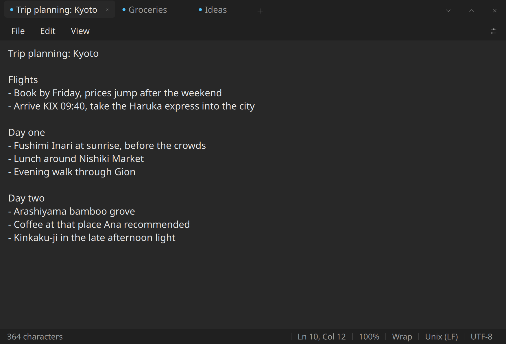
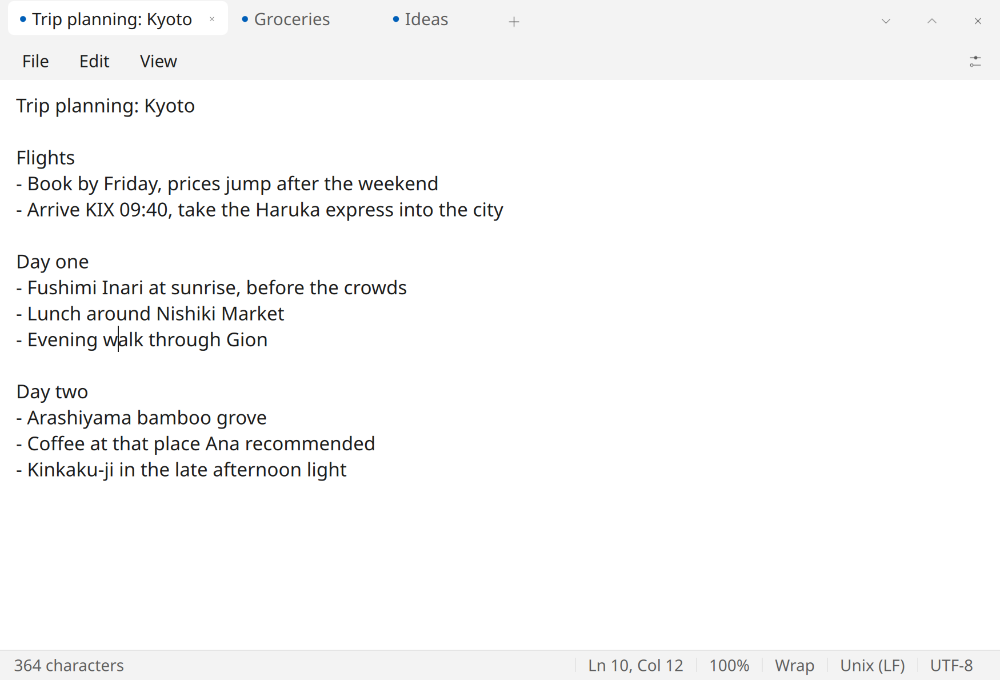
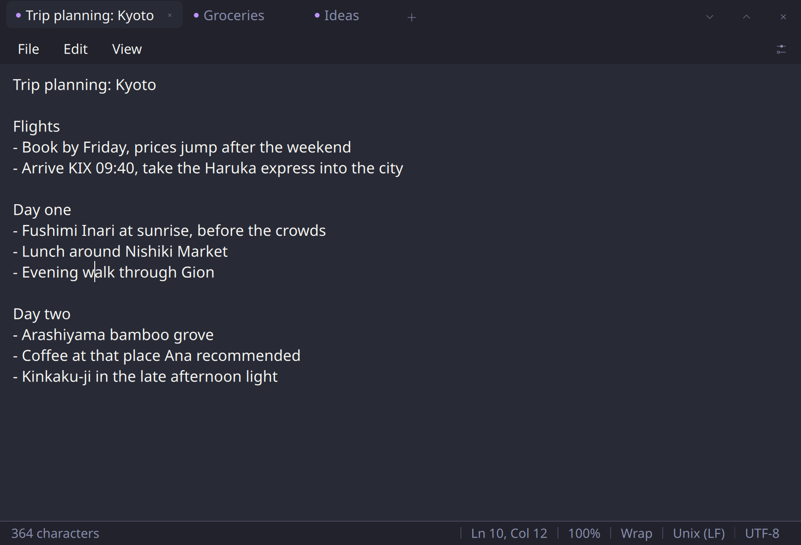

# pnotepad

A simple, light and fast notepad for Linux. Native Rust with a Qt (QML) interface, no Electron, no web view. It starts instantly, idles at a tiny memory footprint, and stays out of your way.



## Why pnotepad

- **Simple**: tabs, a text area, find and replace. Nothing to configure before you can type.
- **Light**: a single small native binary. No background services, no telemetry, fully offline.
- **Fast**: cold start in a blink, instant typing even with many tabs open.

## Never lose a note: autosave and session restore

pnotepad never asks "Do you want to save your changes?". Every tab is continuously autosaved as you type. Close the app, reboot, come back a week later: every tab is restored exactly as you left it, including cursor position, the active tab, and your theme. Unsaved scratch notes are first-class citizens, not something to be rescued on exit.

When you want to clear the deck, **Clear dump** files away all unsaved notes into a folder of your choice, naming each file from its content, then closes them.

## Themes

Eight built-in themes, switched from the menu and remembered across sessions: Dark, Light, Claude, Dracula, Nord, Gruvbox, Solarized Light, Monokai. On first launch pnotepad follows your system color scheme.

| Light | Dracula |
| --- | --- |
|  |  |

## More features

- Tabs, like Windows 11 Notepad
- Find and replace, word wrap, zoom
- Status bar with line and column, character count, encoding
- Single instance: opening a file from anywhere adds a tab to the running window
- Opens and saves plain text and Markdown files

## Install

### Fedora and other RPM distros

```
sudo dnf install https://github.com/sudomastery/perfect-notepad/releases/latest/download/pnotepad-x86_64.rpm
```

### Any distro (AppImage)

```
wget https://github.com/sudomastery/perfect-notepad/releases/latest/download/pnote-x86_64.AppImage
chmod +x pnote-x86_64.AppImage
./pnote-x86_64.AppImage
```

Optional: move it somewhere on your PATH so you can just type `pnote`:

```
mkdir -p ~/.local/bin
mv pnote-x86_64.AppImage ~/.local/bin/pnote
```

## Using pnote from the terminal

```
pnote                 # open the app, restoring the previous session
pnote notes.txt       # open a file (created on save if it does not exist)
pnote a.txt b.md      # open several files as tabs
pnote --help          # show CLI help
pnote --version       # show version
```

If pnotepad is already running, these commands hand the files to the existing window instead of starting a second instance.

## Build from source

Requires Rust (rustup) and Qt 6 development headers:

```
sudo dnf install gcc-c++ qt6-qtbase-devel qt6-qtdeclarative-devel
cargo build --release
```

The binary is at `target/release/pnote`. To install it for your user:

```
install -Dm755 target/release/pnote ~/.local/bin/pnote
install -Dm644 data/pnote.desktop ~/.local/share/applications/pnote.desktop
install -Dm644 data/icons/pnote.png ~/.local/share/icons/hicolor/1024x1024/apps/pnote.png
```

## Storage

Session data lives in `~/.local/share/pnotepad/session/`. Each tab is one plain text file plus an `index.json` with metadata, so your notes are always readable with any tool.

## License

GPL-3.0-or-later
